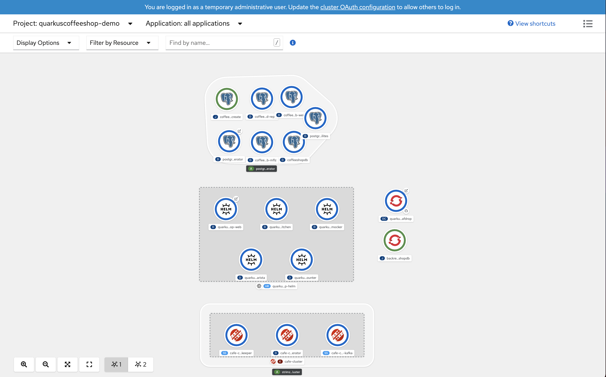
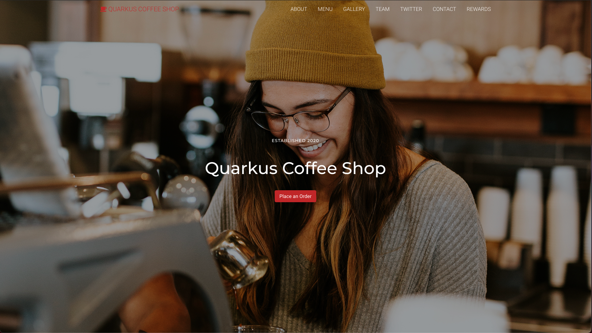

Quarkus Cafe Role
=========

The Quarkus Cafe Role will deploy an event-driven demo application built with Quarkus, AMQ Streams (Kafka), and MongoDB. The application deploys to OpenShift (Kubernetes.)
The source code for the  [quarkus-cafe-demo](https://github.com/jeremyrdavis/quarkus-cafe-demo) application can be found  [here](https://github.com/jeremyrdavis/quarkus-cafe-demo).

Requirements
------------

* OpenShift 4.x Cluster installed
* Ansible should be installed on machine
* oc cli must be installed
* Ansible community.kubernetes module must be installed `ansible-galaxy collection install community.kubernetes`

ScreenShots
------------------------------------------------



http://quarkus-cafe-web-quarkus-cafe-demo.apps.example.com/cafe example



Usage
----------------
* Default web page
http://quarkus-cafe-web-quarkus-cafe-demo.apps.example.com/cafe
this endpoint is used to view the events coming into the cluster
* If you deploy skip_quarkus_cafe_customermock this will automatically push events to the quarkus cafe dashboard.
* If you would like to manally push events to AMQ use the command below.
```shell
export ENDPOINT="quarkus-cafe-web-quarkus-cafe-demo.apps.ocp4.example.com"
curl  --request POST http://${ENDPOINT}/order \
--header 'Content-Type: application/json' \
--header 'Accept: application/json' \
-d '{
    "beverages": [
        {
            "item": "COFFEE_WITH_ROOM",
            "name": "Mickey"
        },
        {
            "item": "CAPPUCCINO",
            "name": "Minnie"
        }
    ],
    "kitchenOrders": [
        {
            "item": "CAKEPOP",
            "name": "Mickey"
        },
        {
            "item": "CROISSANT",
            "name": "Minnie"
        }
    ]
}'
```


Role Variables
--------------
Type  | Description  | Default Value
--|---|--
deployment_method | docker or s2i build | docker
skip_amq_install |  Skip Red Hat AMQ Install  |  false
skip_quarkus_cafe_barista |  Skip quarkus-cafe-barista install  |  false
skip_quarkus_cafe_core |  Skip quarkus-cafe-core install  |  false
skip_quarkus_cafe_kitchen |  Skip quarkus-cafe-kitchen install  |  false
skip_quarkus_cafe_web |  Skip quarkus-cafe-web install  |  false
skip_quarkus_cafe_customermock |  Skip quarkus-cafe-customermock install  |  false
openshift_token | OpenShift login token  | 123456789
openshift_url | OpenShift target url  | https://master.example.com
use_kubeconfig | use the kubeconfig file to authenticate to OpenShift  | true
kubeconfig_path | This defines the path to your kubeconfig folder| /home/username/ocp4folder/auth/kubeconfig
project_namespace | OpenShift Project name for the quarkus-cafe | quarkus-cafe-demo
insecure_skip_tls_verify  |  Skip insecure tls verify  |  true
default_owner | Default owner of template files. | root
default_group | Default group of template files. |  root
delete_deployment  | delete the deployment and project for quarkus-cafe-demo  | false
amqstartingCSV  | Red Hat AMQ csv version  |  amqstreams.v1.5.0
config_location  | default location for application templates  | "/tmp/"
git_url  | Default git url of quarkus-cafe-demo application  | https://github.com/jeremyrdavis/quarkus-cafe-demo.git
quarkus_build_memory_limit  |  quarkus S2I memory build limit | 6Gi
quarkus_build_cpu_limit  |  quarkus S2I cpu build limit | 1
quarkus_core_build_memory_limit  |  quarkus-cafde-core S2I memory build limite  | 8Gi
quarkus_image_stream_name  |  quarkus s2i image version  | ubi-quarkus-native-s2i:20.0.0-java11
domain  |  OpenShift domain endpoint  | ocp4.example.com
kafka_stream_url  |  Kafka stream url | http://quarkus-cafe-web-{{ project_namespace}}.apps.{{ domain }}/dashboard/stream
version_barista | Default container barista tag | 2.4.0
version_core | Default container core tag | 2.4.0
version_customermocker | Default container customermocker tag | 2.3.0
version_kitchen | Default container kitchen tag | 2.4.0
version_web | Default container web tag | 2.4.0

Dependencies
------------

* Ansible
* OpenShift cli

Quick Start
-----------
```
ansible-galaxy collection install community.kubernetes
```

Docker Deployment Quick Start with MongoDB Operator testing.
-----------------------------------------------------------
```
$ git clone https://github.com/tosin2013/quarkus-cafe-demo-role.git
$ cd quarkus-cafe-demo-role
$ git checkout dev
$ cd .. 
$ cd mv  quarkus-cafe-demo-role /etc/ansible/roles
$ export DOMAIN=ocp4.example.com
$ export OCP_TOKEN=123456789
$ cat >deploy-quarkus-cafe.yml<<YAML
- hosts: localhost
  become: yes
  vars:
    deployment_method: docker
    openshift_token: ${OCP_TOKEN}
    openshift_url: https://api.${DOMAIN}:6443
    use_kubeconfig: false
    insecure_skip_tls_verify: true
    default_owner: ${USER}
    default_group: ${USER}
    project_namespace: quarkus-cafe-demo
    delete_deployment: false
    skip_amq_install: false
    skip_mongodb_operator_install: false 
    domain: ${DOMAIN}
    mongodb_admin: jane.doe@example.com
    mongodb_password: Passw0rd.
  roles:
    - tosin2013.quarkus_cafe_demo_role
YAML
$ ansible-playbook  deploy-quarkus-cafe.yml
```

Docker Deployment Quick Start
-----------------------------
```
$ ansible-galaxy install tosin2013.quarkus_cafe_demo_role
$ export DOMAIN=ocp4.example.com
$ export OCP_TOKEN=123456789
$ cat >deploy-quarkus-cafe.yml<<YAML
- hosts: localhost
  become: yes
  vars:
    deployment_method: docker
    openshift_token: ${OCP_TOKEN}
    openshift_url: https://api.${DOMAIN}:6443
    use_kubeconfig: false
    insecure_skip_tls_verify: true
    default_owner: ${USER}
    default_group: ${USER}
    project_namespace: quarkus-cafe-demo
    delete_deployment: false
    skip_amq_install: false
    domain: ${DOMAIN}
  roles:
    - tosin2013.quarkus_cafe_demo_role
YAML
$ ansible-playbook  deploy-quarkus-cafe.yml
```


Example Playbook using docker 
----------------
```
- hosts: localhost
  become: yes
  vars:
    deployment_method: docker
    openshift_token: 123456789
    openshift_url: https://api.ocp4.example.com:6443
    use_kubeconfig: false
    insecure_skip_tls_verify: true
    default_owner: root
    default_group: root
    version_barista: 2.4.0
    version_core: 2.4.0
    version_customermocker: 2.3.0
    version_kitchen: 2.4.0
    version_web: 2.4.0
    project_namespace: quarkus-cafe-demo
    delete_deployment: false
    skip_amq_install: false
    skip_quarkus_cafe_barista: false
    skip_quarkus_cafe_core: false
    skip_quarkus_cafe_kitchen: false
    skip_quarkus_cafe_web: false
    skip_quarkus_cafe_customermock: false
    domain: ocp4.example.com
  roles:
    - quarkus-cafe-demo-role
```

Example Playbook s2i
----------------
```
- hosts: localhost
  become: yes
  vars:
    deployment_method: docker
    use_kubeconfig: true
    kubeconfig_path: /home/username/ocp4folder/auth/kubeconfig
    insecure_skip_tls_verify: true
    default_owner: root
    default_group: root
    version_barista: 2.4.0
    version_core: 2.4.0
    version_customermocker: 2.3.0
    version_kitchen: 2.4.0
    version_web: 2.4.0
    project_namespace: quarkus-cafe-demo
    delete_deployment: false
    skip_amq_install: false
    skip_quarkus_cafe_barista: false
    skip_quarkus_cafe_core: false
    skip_quarkus_cafe_kitchen: false
    skip_quarkus_cafe_web: false
    skip_quarkus_cafe_customermock: false
    quarkus_build_memory_limit: 6Gi
    quarkus_build_cpu_limit: 1
    quarkus_core_build_memory_limit: 8Gi
    domain: ocp4.example.com
  roles:
    - quarkus-cafe-demo-role
```


Troubleshooting
---------------
Force delete kafka crds after bad install
```
oc get crds -o name | grep '.*\.strimzi\.io' | xargs -r -n 1 oc delete
```

To-Do
-------
* ACM deployment 
* Ansible k8s – Manage Kubernetes (K8s) objects deployment example


License
-------

GPLv3

Author Information
------------------

This role was created in 2020 by [Tosin Akinosho](https://github.com/tosin2013)


