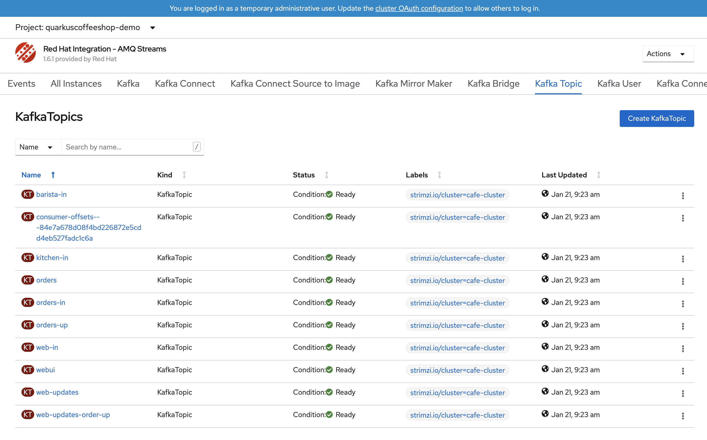

# Docs
Please see the Github Pages Site for complete documentation: [quarkuscoffeeshop.github.io](https://quarkuscoffeeshop.github.io)

QuarkusCoffeeshop Install
=========

_NOTE:_ Ansible must be installed https://docs.ansible.com/ansible/latest/installation_guide/index.html

The QuarkusCoffeeshop Ansbile Role performs a basic installation that includes the microservices for a coffeeshop, installation of the Crunchy PostgreSQL DB, AMQ Streams (Kafka.)


The QuarkusCoffeeshop Role will deploy an event-driven demo application built with Quarkus, AMQ Streams (Kafka), and MongoDB. The application deploys to OpenShift (Kubernetes.)
The source code for the  [quarkuscoffeeshop](https://github.com/quarkuscoffeeshop) application support doc can be found  [here](https://github.com/quarkuscoffeeshop/quarkuscoffeeshop-support).

## Podman builds 
``` 
podman build -t  quarkuscoffeeshop-ansible:v0.0.1 -f Dockerfile
```

```
 podman run  -it quarkuscoffeeshop-ansible:v0.0.1 bash 
```

```
podman rmi  $(podman images   | grep "<none>" | awk '{print $3}')
podman rmi localhost/quarkuscoffeeshop-ansible:v0.0.1
```

```
podman rmi localhost/quarkuscoffeeshop-ansible:v0.0.1 
```

## Quick Start 
**Download the deploy-quarkuscoffeeshop-ansible.sh shell script**
```
curl -OL https://raw.githubusercontent.com/quarkuscoffeeshop/quarkuscoffeeshop-ansible/master/files/deploy-quarkuscoffeeshop-ansible.sh
chmod +x deploy-quarkuscoffeeshop-ansible.sh
```

**Set Environment variables for standard deployment**
> This command will deploy the application on a Single cluster with the following services below. 
* AMQ Streams
* Postgres Operator configuration 
* quarkus coffeeshop helm deployment
```
$ cat >env.variables<<EOF
ACM_WORKLOADS=n
AMQ_STREAMS=y
CONFIGURE_POSTGRES=y
MONGODB_OPERATOR=n
MONGODB=n
HELM_DEPLOYMENT=y
EOF
$ ./deploy-quarkuscoffeeshop-ansible.sh -d ocp4.example.com -t sha-123456789 -p 123456789 -s ATLANTA
```

Requirements
------------

* OpenShift 4.10 an up Cluster installed
* Ansible should be installed on machine
* oc cli must be installed
* Ansible community.kubernetes module must be installed `ansible-galaxy collection install community.kubernetes`
* Install [Helm](https://helm.sh/docs/intro/install/) Binary
* [Postges Operator](https://github.com/tosin2013/postgres-operator) for Quarkus CoffeeShop 5.0.1-SNAPSHOT Deployments
* pip3 

Quick Start 
-----------
> IN RHPDS OpenShift 4.10  WorkShop Cluster
```
dnf install ansible -y
curl -OL https://raw.githubusercontent.com/quarkuscoffeeshop/quarkuscoffeeshop-ansible/dev/files/deploy-quarkuscoffeeshop-ansible.sh
chmod +x deploy-quarkuscoffeeshop-ansible.sh
./deploy-quarkuscoffeeshop-ansible.sh -d ocp4.example.com -t sha-123456789 -s ATLANTA
```

ScreenShots
------------------------------------------------




http://quarkuscoffeeshop-web-quarkus-cafe-demo.apps.example.com example


Usage
----------------
* Default web page 5.0.1-SNAPSHOT  
  * http://quarkuscoffeeshop-web-quarkus-cafe-demo.apps.example.com/
this endpoint is used to view the events coming into the cluster
* Default web page v3.3.1  
  * http://quarkuscoffeeshop-web-quarkus-cafe-demo.apps.example.com/cafe
this endpoint is used to view the events coming into the cluster
* If you deploy skip_quarkus_cafe_customermock this will automatically push events to the quarkus cafe dashboard.
* If you would like to manally push events to AMQ use the command below.
```shell
export ENDPOINT="quarkuscoffeeshop-web-quarkus-cafe-demo.apps.ocp4.example.com"
curl  --request POST http://${ENDPOINT}/order \
--header 'Content-Type: application/json' \
--header 'Accept: application/json' \
-d '{
    "beverages": [
        {
            "item": "COFFEE_WITH_ROOM",
            "name": "Mickey"
        },
        {
            "item": "CAPPUCCINO",
            "name": "Minnie"
        }
    ],
    "kitchenOrders": [
        {
            "item": "CAKEPOP",
            "name": "Mickey"
        },
        {
            "item": "CROISSANT",
            "name": "Minnie"
        }
    ]
}'
```


Role Variables
--------------
Type  | Description  | Default Value
--|---|--
deployment_method | docker or s2i build | docker
skip_amq_install |  Skip Red Hat AMQ Install  |  false
skip_mongodb_operator_install |  Skip MongoDB Operator Install  |  false
single_mongodb_install | Skip single instance mongodb | false
skip_quarkuscoffeeshop_helm_install |  Skip quarkuscoffeeshop helm chart install  |  false
openshift_token | OpenShift login token  | 123456789
openshift_url | OpenShift target url  | https://master.example.com
project_namespace | OpenShift Project name for the quarkus-cafe | quarkus-cafe-demo
insecure_skip_tls_verify  |  Skip insecure tls verify  |  true
default_owner | Default owner of template files. | root
default_group | Default group of template files. |  root
delete_deployment  | delete the deployment and project for quarkus-cafe-demo  | false
amqstartingCSV  | Red Hat AMQ csv version  |  amqstreams.v1.6.1
mongodbstartingCSV  | MongoDB Ops Manager version  |  mongodb-enterprise.v1.8.0
config_location  | default location for application templates  | "/tmp/"
version_barista | Default container barista tag | 5.0.0-SNAPSHOT
version_counter | Default container counter tag | 5.0.1-SNAPSHOT
version_customermocker | Default container customermocker tag | 3.0.1
version_kitchen | Default container kitchen tag | 5.0.0-SNAPSHOT
version_web | Default container web tag | 5.0.1-SNAPSHOT
helm_chart_version | Version of Qaurkus Cafe Helm Chart | 3.4.4
pgsql_username | Default postgress user  | coffeshopadmin
postgres_password | this is the postgress password that will be used in deployment| must be changed
pgsql_url | default postgres URL | 'jdbc:postgresql://coffeeshopdb:5432/coffeeshopdb?currentSchema=coffeeshop'
storeid | Store id for web frontend | RALEIGH
quarkus_log_level | Quarkus coffee shop log level |  INFO
quarkuscoffeeshop_log_level | Microservice log level | DEBUG


Dependencies
------------

* Ansible
* OpenShift cli
* helm 

Quarkus CoffeeShop 5.0.3-SNAPSHOT OpenShift Deployment   
-----------------------------------------------------------

## Download Script
```
curl -OL https://raw.githubusercontent.com/quarkuscoffeeshop/quarkuscoffeeshop-ansible/dev/files/deploy-quarkuscoffeeshop-ansible.sh
chmod +x deploy-quarkuscoffeeshop-ansible.sh
```

**Set Environment variables for ACM WORKLOADS**
* Gogs server
* OpenShift Pipelines
* OpenShift GitOps
* Quay.io
* AMQ Streams
* Postgres Template deployment
* homeoffice Tekton pipelines
* quarkus-coffeeshop Tekton pipelines
```
$ cat >env.variables<<EOF
ACM_WORKLOADS=y
AMQ_STREAMS=y
CONFIGURE_POSTGRES=n
MONGODB_OPERATOR=n
MONGODB=n
HELM_DEPLOYMENT=n
EOF
$ ./deploy-quarkuscoffeeshop-ansible.sh -d ocp4.example.com -t sha-123456789 -s ATLANTA
```

**Set Environment variables for standard deployment**
* AMQ Streams
* Postgres Operator configuration 
* quarkus coffeeshop helm deployment
```
$ cat >env.variables<<EOF
ACM_WORKLOADS=n
AMQ_STREAMS=y
CONFIGURE_POSTGRES=y
MONGODB_OPERATOR=n
MONGODB=n
HELM_DEPLOYMENT=y
EOF
$ ./deploy-quarkuscoffeeshop-ansible.sh -d ocp4.example.com -t sha-123456789 -p 123456789 -s ATLANTA
```

**Optional: Change namespace for helm deployments**  
`default is quarkuscoffeeshop-demo`
```
$ cat >env.variables<<EOF
ACM_WORKLOADS=n
AMQ_STREAMS=y
CONFIGURE_POSTGRES=y
MONGODB_OPERATOR=n
MONGODB=n
HELM_DEPLOYMENT=y
EOF
$ NAMESPACE=changeme
$  sed -i "s/quarkuscoffeeshop-demo/${NAMESPACE}/g" deploy-quarkuscoffeeshop-ansible.sh
```


Quarkus CoffeeShop v3.3.1 and lower dependencies
-----------
```
ansible-galaxy collection install community.kubernetes

# Install Helm 
$ curl -fsSL -o get_helm.sh https://raw.githubusercontent.com/helm/helm/master/scripts/get-helm-3
$ chmod 700 get_helm.sh
$ ./get_helm.sh
```

Quarkus CoffeeShop v3.3.1 OpenShift Deployment  with MongoDB Operator
-----------------------------
```
$ ansible-galaxy install tosin2013.quarkus_cafe_demo_role
$ export DOMAIN=ocp4.example.com
$ export OCP_TOKEN=123456789
$ cat >deploy-quarkus-cafe.yml<<YAML
- hosts: localhost
  become: yes
  vars:
    openshift_token: ${OCP_TOKEN}
    openshift_url: https://api.${DOMAIN}:6443
    insecure_skip_tls_verify: true
    default_owner: ${USER}
    default_group: ${USER}
    project_namespace: quarkuscoffeeshop-demo
    delete_deployment: false
    skip_amq_install: false
    skip_configure_postgres: true
    skip_mongodb_operator_install: false
    skip_quarkuscoffeeshop_helm_install: false
    domain: ${DOMAIN}
    helm_chart_version: 3.3.0
    version_barista: 3.0.0
    version_counter: 3.1.0
    version_customermocker: 3.0.1
    version_kitchen: 3.1.0
    version_web: 3.1.0
  roles:
    - tosin2013.quarkus_cafe_demo_role
YAML
$ ansible-playbook  deploy-quarkus-cafe.yml
```

Quarkus CoffeeShop v3.3.1 OpenShift Deployment  with single mongoDB instance
-----------------------------
```
$ ansible-galaxy install tosin2013.quarkus_cafe_demo_role
$ export DOMAIN=ocp4.example.com
$ export OCP_TOKEN=123456789
$ cat >deploy-quarkus-cafe.yml<<YAML
- hosts: localhost
  become: yes
  vars:
    openshift_token: ${OCP_TOKEN}
    openshift_url: https://api.${DOMAIN}:6443
    insecure_skip_tls_verify: true
    default_owner: ${USER}
    default_group: ${USER}
    project_namespace: quarkuscoffeeshop-demo
    delete_deployment: false
    skip_amq_install: false
    skip_configure_postgres: true
    skip_mongodb_operator_install: true
    single_mongodb_install: true
    skip_quarkuscoffeeshop_helm_install: false
    domain: ${DOMAIN}
    helm_chart_version: 3.3.0
    version_barista: 3.0.0
    version_counter: 3.1.0
    version_customermocker: 3.0.1
    version_kitchen: 3.1.0
    version_web: 3.1.0
  roles:
    - tosin2013.quarkus_cafe_demo_role
YAML
$ ansible-playbook  deploy-quarkus-cafe.yml
```


Troubleshooting
---------------
Force delete kafka crds after bad install
```
oc get crds -o name | grep '.*\.strimzi\.io' | xargs -r -n 1 oc delete
```

To-Do
-------
* Ansible k8s – Manage Kubernetes (K8s) objects deployment example


License
-------

GPLv3

Author Information
------------------

This role was created in 2020 by [Tosin Akinosho](https://github.com/tosin2013)


